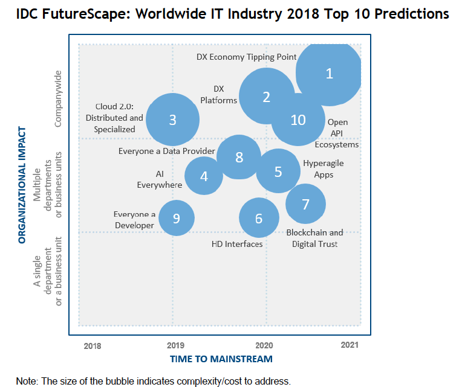
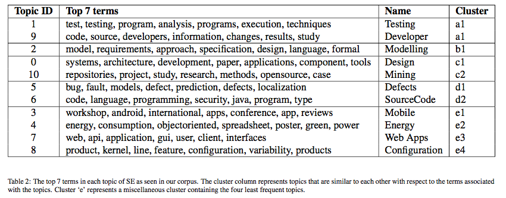
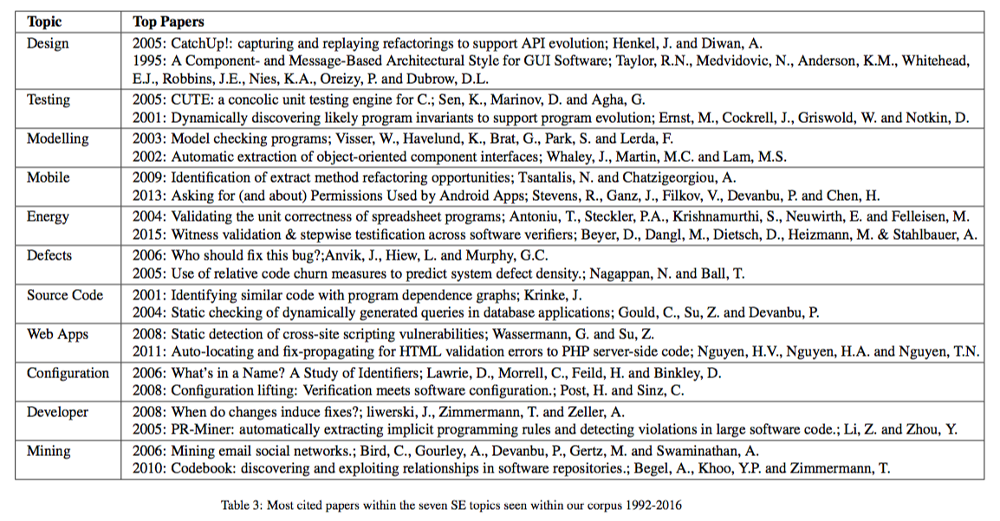
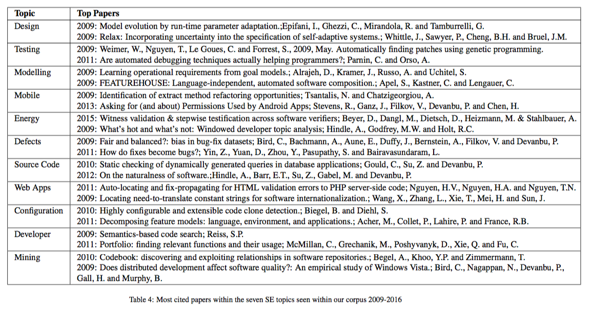
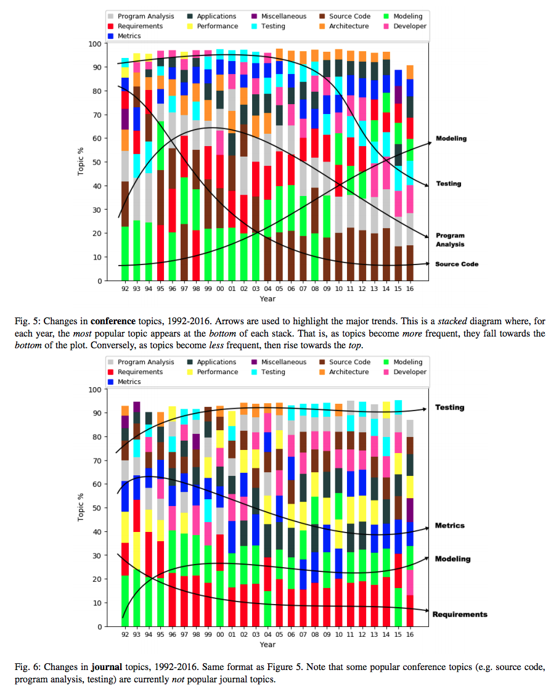

[home](http://tiny.cc/seng18) |
[copyright](https://github.com/txt/seng18/blob/master/LICENSE.md) &copy;2018, tim&commat;menzies.us
 
 
[syllabus](https://github.com/txt/seng18/blob/master/doc/syllabus.md) |
[src](https://github.com/txt/seng18/tree/master/src) |
[submit](http://tiny.cc/seng18give) |
[chat](https://seng18.slack.com/)

______

# Lecture2: What is Software Engineering?

## What Does Software Do?

Software engineers build and control the software that
controls the world:

+ Silicon valley developers view every new feature
  as an experiment, to be tested within some mash
  up.
+ Chemists win Nobel Prize for software sims
  [http://goo.gl/p8YScA](http://goo.gl/p8YScA);
+ Engineers use software to optical tweezers,
  radiation therapy, remote sensing, chip design,
  [http://goo.gl/qBMyIZ](http://goo.gl/qBMyIZ);
+ Web analysts use software to analyze clickstreams
  to improve sales and marketing strategies;
  [http://goo.gl/b26CfY](http://goo.gl/b26CfY)
+ Stock traders write software to simulate trading
  strategies [http://www.quantopian.com](http://www.quantopian.com);
+ Analysts write software to mine labor statistics
  data to review proposed gov policies
  [http://goo.gl/X4kgnc](http://goo.gl/X4kgnc);
+ Journalists use software to analyze economic data,
  make visualizations of their news stories
  [http://fivethirtyeight.com](http://fivethirtyeight.com);
+ In London or New York, ambulances wait for your
  call at a location determined by a software model
  [http://goo.gl/8SMd1p](http://goo.gl/8SMd1p);
+ Etc etc etc  

Software literally controls what we think about the
world around us:

+ Eli Pariser:
      + <em>As web companies strive to tailor their
        services (including news and search results)
        to our personal tastes, there's a dangerous
        unintended consequence: We get trapped in a
        "filter bubble" and don't get exposed to
        information that could challenge or broaden
        our worldview.</em>
+ E.g. at the height of the Arab spring riots in Cairo,
  two people search for "Egypt"
     + One gets to see the riots;
     + The other gets to see pretty pictures of tourist attractions.

## So What Do Software Engineers Do?

Software Engineering is the:

+ process of the
+ design,
+ construction and
+ maintenance of
+ good enough
+ software,
+ given the available resources.

The last point means that we are always trading off
between what we want with what we need with what
we've got. Software engineers, therefore are the
people we look to:

+ Make and
+ justify
+ well-informed decisions
+ about trade-offs
+ in software engineering.

This, in turn means that at any time, software
engineering are aware of multiple possibilities and
the reasons why we should be doing one, and not the
others.

Parts of SE:

- requirements;
- architecture;
- process (life cycle);
- risk management;
- patterns, anti-patterns, bad smells;
- construction;
- verification;
- testing;
- maintenance, enhancement;
- programming languages and databases.

## Why Software is so Interesting... Now

It took a long time to realize it organizing software was a thing:

- In 1973, Barry Boehm has asked to comment on the
  major factors associated with using computers.
       - DARPA had expected him to predict that
         hardware would remain the biggest problem,
         encouraging them to invest in even larger
         computers.
       - Instead, Boehm shocked them all, predicting
         that software costs would overwhelm
         hardware costs.
- Later in the 1970s, Bell Labs invented a revolutionary concept (a platform independent software operating systems called UNIX)
that increased the market for software written a certain way (i.e. using UNIX).
      - That software was the tool that lead us to widespread interoperability and the World Wide Web.
      - Before that, software only worked on whatever particular hardware platform it was originally built for.
- In 1982, Bill Gates sold (another)  operating systems to IBM call _DOS_
       - IBM was expecting Microsoft to ask for more
         money upfront or at least as for a per-copy
         royalty.
       - Instead Microsoft negotiated for the
         ability to sell DOS to other companies.
   - Thanks to the non-exclusive agreement,
     that set
     the stage for Microsoft to dominate the PC
     operating system industry for years.
   - Why did IBM agree to the non-exclusive agreement?
   - Because the industry, including IBM, did
         not believe that anyone could make money
         from software.

 
Since them, much as changed:

The world's first web site
(info.cern.ch), published on August 6, 1991 by British physicist Tim Berners-Lee: 

Since then, some other web sites have come on-line:

## The Standard Pictures

The big picture:

A slightly more detailed picture:

 
## The Great Secrets of the V-diagram

Software =

+ 1/3 planning (requirements, design)
+ 1/6th coding,
+ 1/4 unit test,
+ 1/4 system test

Surprise #1: Coding is the not the (only) product of design:

- Rather, it is generates all the expectation knowledge telling us
  how to test the system.

Surprise #2:  testing takes half the time?

- Maurice Wikes, 1949
     - "I well remember when this realization first came
       on me with full force."
 - "The EDSAC was on the top
       floor of the building and the tape-punching and
       editing equipment one floor below..."
     - "It was on one of my journeys between the
        EDSAC room and the punching equipment that
        "hesitating at the angles of stairs" the
        realization came over me with full force
        that a good part of the remainder of my life
        was going to be spent in finding errors in
        my own programs."
- More recent updates:
 + [http://en.wikipedia.org/wiki/List_of_software_bugs](http://en.wikipedia.org/wiki/List_of_software_bugs)
     + [http://catless.ncl.ac.uk/Risks/](http://catless.ncl.ac.uk/Risks/)

## Reasons to be Cheerful

[The Non-Existent Software Crisis: Debunking the Chaos Report](http://www.drdobbs.com/architecture-and-design/the-non-existent-software-crisis-debunki/240165910?pgno=1)

## Predictions for the Future

### From Microsoft

[Microsoft researchers on what to expect in 2017 and 2027](http://blogs.microsoft.com/next/2016/12/05/17-17-microsoft-researchers-expect-2017-2027/#sm.001sdp80c140eeerrun1l2cvowaft) 

### From IDC

From [IDC Predictions 2018 ](img/predictions18.pdf)
Frank Gens, IDC Predictions 2018 Team.

In the following:

- ""mainstream"  means the broad middle of the bell
curve of adoption (i.e., the 40–60% of enterprises movers and early
adopters nor the last to act).
- DX = digitial transformation to a digital-native enteprise. 
     - Given the looming digitization of more than half of the global economy, digital transformation
       will continue to rise on CEOs' and line-of-business (LOB) executives' priority lists.
     - The urgency to digitally transform will drive an increasingly large portion of ICT budgets. By
       the end of 2019, digital transformation spending is expected to reach $1.7 trillion worldwide, a

Drivers:

- Accelerating DX: Technology-centric transformation altering business and society
- Pace of change: Technology capabilities enable sustainable change at the speed of digital business
-  DX delta: Leaders and disruptors widen performance gap
-  Human versus machine: The impact of AI and automation
-  Sense, compute, actuate: The new data-centric paradigm
-  Platform disruption: Unleashing digital innovation's power for scale
-  Cyberthreats: Theft, ransom, and cyberattack on the rise
-  Shifting economics: Changing value structures and the rise of digital capital
-  The future workforce: Global demand for digital talent
-  Innovation impasse: Legacy systems constraining transformation

______

### Frontiers of SE 

[Clustering 16,000 conferences from SE conferences 1993 to 2016](https://arxiv.org/pdf/1608.08176)

Clusters found:

	
Top 2 most cited papers....

... last 25 years

... recently (this decade) 

- Program Analysis = program, analysis, dynamic, execution, code, java, static
- Requirements = requirements, design, systems, architecture, analysis, process, development
- Metrics = metrics, data, quality, effort, prediction, defect, analysis
- Applications = applications, web, systems, component, services, distributed, user
- Performance = performance, time, data, algorithm, systems, problem, network, distributed
- OOPS = object-oriented, programming, realtime, systems, section, functional, java
- Testing =  test, testing, cases, fault, techniques, coverage, generation
- Source Code = code, source, information, tool, program, developers, patterns
- Architecture =  architecture, component, systems, design, product, reuse, evolution
- Modeling = model, language, specification, systems, techniques, object, uml
- Developer =  developer, project, bug, work, open, team, tools

