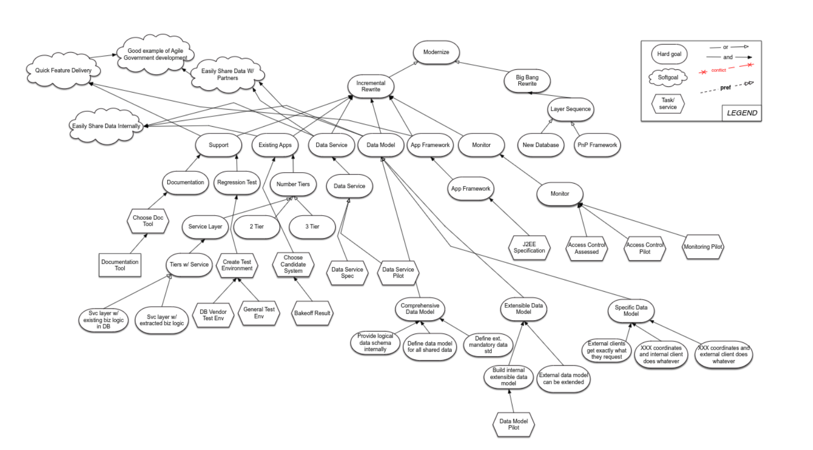

[home](http://tiny.cc/seng18) |
[copyright](https://github.com/txt/seng18/blob/master/LICENSE.md) &copy;2018, tim&commat;menzies.us
<br>
[](http://tiny.cc/seng18)<br>
[syllabus](https://github.com/txt/seng18/blob/master/doc/syllabus.md) |
[src](https://github.com/txt/seng18/tree/master/src) |
[submit](http://tiny.cc/seng18give) |
[chat](https://seng18.slack.com/)


______


# Review4

## Requirement: 

- What kind of problem is finding/choosing requirements of SE?
- What are soft goals from this diagram?
- Defend this statement: 
  - Big Bang Rewrite less costly than Incrementally Rewrite
  - We should not do Big Bang Rewrite


## Visual Notations for Programming:
 
- Write two advantages of state chart. 
- When state chart is not recommended?
- Draw a state chart for the following states and transitions:

```
struct transition state_transitions [] = {
{entry, ok, foo},
{entry, fail, end},
{foo, ok, bar},
{foo, fail, end},
{foo, repeat, foo},
{bar, ok, end},
{bar, fail, end},
{bar, repeat, foo}};
```  

- Write three differences between SQL and No-SQL.
- Suppose you have three tables in database: University, Subject and Student. What are insert, update and delete anomalies in this context?
- How ER based model solves different anomalies for the above scenario? Explain.
- Why doe some people claim ER is not suitable for agile development?
-  What state chart and ER based models have in common?

# 04/03/2018
- What went wrong with the Facebook privacy scandal?
- Who are the stakeholders for Facebook? and what do they want?
- With the privacy problem, through the lens of a specific stakeholder and their demand, what do you propose to change/move forward?
- What is compartmental model? Give a small example of using this model for a grocery shop supply chain from warehouse to supermarket shelves.
- What are the limitations of compartmental model?
- What is UML?
- What are few ways to write small class diagrams?
- What are the few reasons of not using UML?
