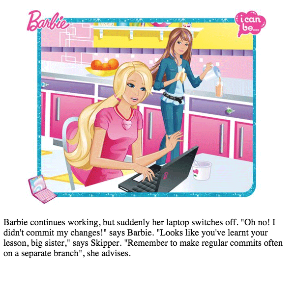
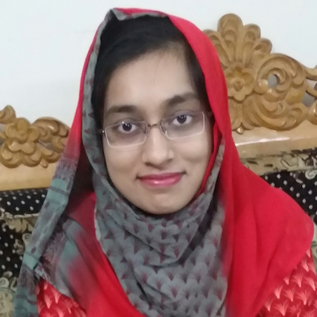

[home](http://tiny.cc/seng18) |
[copyright](https://github.com/txt/seng18/blob/master/LICENSE.md) &copy;2018, tim&commat;menzies.us
 
 
[syllabus](https://github.com/txt/seng18/blob/master/doc/syllabus.md) |
[src](https://github.com/txt/seng18/tree/master/src) |
[submit](http://tiny.cc/seng18give) |
[chat](https://seng18.slack.com/)

______

# Syllabus 

CSC 510 - 001 (2216)    
NcState, ComSci    
Spring 2017

EE-II room 1021    
Tues,Thurs 4:30PM - 5:45PM  

____

## Overview

### Topics

An introduction to software life cycle models; size
estimation; cost and schedule estimation; project
management; risk management; formal technical
reviews; analysis, design, coding and testing
methods; configuration management and change
control; and software reliability
estimation. Emphasis on large development
projects. A group project required following
good software engineering practices throughout the
semester.

### Objectives

Students are expected to gain practical exposure to
tools, processes, and principles of software
engineering through hands-on projects while being
able to explain empirical and theoretical evidence,
technical mechanisms, and models supporting software
engineering.

### Prerequisites

+ CSC 316 and CSC 226

### Textbook

+ [Software Engineering: A Practitioner's Approach, 7th International edition](https://www.amazon.com/gp/offer-listing/0071267824/ref=dp_olp_used?ie=UTF8&condition=used)
by Roger Pressman (optional).

### Assessment

Student will sit exams to determine their understanding of lecture material.

<!-- a href="https://computer-engineer-barbie.herokuapp.com/"></a --->
Students will work in groups of three using Github
to test their ability to work in groups to deliver software.

Students will use Github to store their software and Github issues to document their communications
between each other for that project.

Grades will be assigned as follows:

- Spot quizes, misc (quick) home works, 5 marks.
- Mid-term: Tuesday, March2, 15 marks
- Final exam: 20 marks
- Participation in evaluations: 10 marks (one per evaluation)
      - Students will be issued 10 "chits" with 10 magic numbers
      - When they perform any evaluation, they hand over the "chit"
      - When students hand in their Jan31 and Mar31 reports, they list the chit numbers of the students present for their evals.
      - Chits must be "spent" in other projects (you cannot hand in chits from your own people for your own project).
- Project: 50 marks,  

|due|marks|notes|
|---|-----|-----|
|Jan31|10| Initial project description: - Report on related work (5 marks)  - short talk to class (5marks)  - And your project name and URL [here](tiny.cc/se17give)|
| Feb28|10| Progress report: - Report on 3 propose solutions and evaluation plan (5 marks) - Demos to lecturer or tutor (marks deducted if absent) - Much Github activity from all developers(*) (5marks). Submit link to [this page in your repo](https://github.com/ai-se/eebm/graphs/contributors) |
| Mar31|20| Final report: - 10min talk to the class  (10 marks);   - A report document (results and recommendations)  (10 marks). See [example](https://goo.gl/3C82cj)|
| Apr28|10| A report on "bad smell detection" in Github issues; e.g.  [here](https://github.com/CSC510-2015-Axitron/project2)|

(*) An active Github repo contains dozens to hundreds of commits and issues; all issues are in five to twenty (or more) milestones;
issues are labeled;
issues are getting opened and closed; (some) milestones are getting completed (but others might actually be your plan for your March work);
all members of the team are contributing equally (plus or minus 33%).

With the final grades, the following grade scale will be used: 

     A+ (97-100),  A (93-96),   A-(90-92)
     B+ (87-89),   B (83-86),   B-(80-82)
     C+ (77-79),   C (73-76),   C-(70-72)
     D+ (67-69),   D (63-66),   D-(60-62)
     F (below 60).

### Group Slack group

It is each student's responsibility to join the Slack  group:

+ [https://se17.slack.com](https://se17.slack.com)
+ Students are strongly encouraged to contribute their questions and answers to that shared resource.
+ Note that, for communication of a more private nature, contact the lecturer on the email shown below.

All class communication from staff to students will be via this Slack group.

**IMPORTANT:** Students should not use Slack from their intra-group communication. All such communication
should be via Github. Why? Well, the final project is a decision support system that reflects over the
issue close times of data in Github.

____

## Staff

### Lecturer

Tim Menzies 

+ Github id: timm
+ Office Hours: Tuesday, 2:30-4:30 and by request
+ Location of Office Hours: EE II room 3298 
+ E-Mail: tim.menzies@gmail.com 
  + Only use this email for private matters. All other class communication should be via the class news group,    listed below.
+ Phone: 304-376-2859
       + **Do not use** this number, except in the most dire of 
          circumstances (best way to contact me is via email).

### Tutor

Effat Farhana 

+ Github id:  effat
+ E-mail: efarhan@ncsu.edu
  + Only use this email for private matters.
  + All other class communication should be via the class news group, listed after.
+ Office hours: Wed 12:00 to 2pm
+ Office location: 1229B

____

## Other Information

### Attendance

Attendance is extremely important for your learning
experience in this class. Once you reach three
unexcused absences, each additional absence will
reduce your attendance grade by 10%.

As to what is an "excused" class, see the list at 
[https://policies.ncsu.edu/regulation/reg-02-20-03](https://policies.ncsu.edu/regulation/reg-02-20-03):

- Anticipated absences:
     - Representing an official university function (e.g. athletics)
     - Required court attendance as certified by the Clerk of Court.
     - Students will be allowed a minimum of two excused absences per academic year for religious observances 
     - Required military duty as certified by the student's commanding officer.
- Unanticipated absences. Examples include:
     - Short-term illness or injury
     - Death or serious illnesses in the family when documented appropriately. 

#### Attendance in Week1

Regarding attendance in week one,
material will be presented
n the first week  that
is important for the course, assignments, and exams.
Groups will be formed for project(s).
It will be each student's
 responsibility to make up any missed lecture
material or sort out group membership after your
return, and you should not expect the instructor or
TAs to offer any make up or other supplemental
material for the days that you miss.

### Expected Workload

 Students must be
prepared to dedicate AT LEAST 5-8 working hours a
week to this class (excluding the time spent in the
classroom). Laboratory instruction is not included
in this subject.

Sometimes, the lecturer/tutor will require you to
attend a review session during their consultation
time. There, students may be asked to review code,
concepts, or comment on the structure of the
course. Those sessions are mandatory and failure to
attend will result in marks being deducted.

### Academic Integrity

Cheating will be punished to the full extent permitted. Cheating
includes plagerism of other people's work. All students will be working
on public code repositories and **informed reuse** is encouraged where
someone else's product is:

+ Imported and clearly acknowledged (as to where it came from);
+ The imported project is understood, and
+ The imported project is significantly extended.

Students are encouraged to read each others code and report **uninformed reuse**
to the lecturer. The issue will be explored and, if uncovered,
cheating will be reported to the university
and marks will be deducted if the person who is doing the reuse:

+ Does not acknowledge the source of the product;
+ Does not exhibit comprehension of the product when asked about it;
+ Does not significantly extend the product.

All students are expected to maintain traditional
standards of academic integrity by giving proper
credit for all work.  All suspected cases of
academic dishonesty will be aggressively pursued.
You should be aware of the University policy on
academic integrity found in the Code of Student
Conduct.
 
The  exams will be done individually.  Academic integrity is important.  Do not work together on the exams: cheating on either will be punished to the full extent permitted.

### Disabilities

Reasonable accommodations will be made for students
with verifiable disabilities. In order to take
advantage of available accommodations, students must
register with Disability Services for Students at
1900 Student Health Center, Campus Box 7509,
919-515-7653. For more information on NC State's
policy on working with students with disabilities,
please see the Academic Accommodations for Students
with Disabilities Regulation(REG 02.20.01).

Students are responsible for reviewing the PRRs
which pertain to their course rights and
responsibilities. These include:
[http://policies.ncsu.edu/policy/pol-04-25-05](http://policies.ncsu.edu/policy/pol-04-25-05)
(Equal
Opportunity and Non-Discrimination Policy
Statement),
[https://oied.ncsu.edu/home/](https://oied.ncsu.edu/home/)
(Office for Institutional Equity and
Diversity),
[http://policies.ncsu.edu/policy/pol-11-35-01](http://policies.ncsu.edu/policy/pol-11-35-01)
(Code of Student Conduct), and
[http://policies.ncsu.edu/regulation/reg-02-50-03](http://policies.ncsu.edu/regulation/reg-02-50-03)
(Grades and Grade Point Average).

### Non-Discrimination Policy

NC State University provides equality of opportunity
in education and employment for all students and
employees. Accordingly, NC State affirms its
commitment to maintain a work environment for all
employees and an academic environment for all
students that is free from all forms of
discrimination. Discrimination based on race, color,
religion, creed, sex, national origin, age,
disability, veteran status, or sexual orientation is
a violation of state and federal law and/or NC State
University policy and will not be
tolerated. Harassment of any person (either in the
form of quid pro quo or creation of a hostile
environment) based on race, color, religion, creed,
sex, national origin, age, disability, veteran
status, or sexual orientation also is a violation of
state and federal law and/or NC State University
policy and will not be tolerated.

+ Note that, as a lecturer, I am legally required to
**report** all such acts to the campus policy1.

1Note that any remark you make
in some on-line comment tracking system like Github
is a public document.
So take heed of the following cautionary tale.
One year, a student was joking around with
his buddy in a Github issue report. Then he was
rude enough and stupid enough to 
add a remark about how the rest of the
team was just so
&#9632;&#9632;&#9632;&#9632;
&#9632;&#9632;&#9632;&#9632;&#9632;&#9632;&#9632;&#9632;.
Needless to say,
the rest of the team took great
offense at this remark and invoked the University's
non-discrimination policies. As a result, everyone
lost much time that semester, as well as grades. 

Retaliation
against any person who complains about
discrimination is also prohibited. NC State's
policies and regulations covering discrimination,
harassment, and retaliation may be accessed at
[http://policies.ncsu.edu/policy/pol-04-25-05](http://policies.ncsu.edu/policy/pol-04-25-05) or
[http://www.ncsu.edu/equal_op/](http://www.ncsu.edu/equal_op/).
Any person who feels
that he or she has been the subject of prohibited
discrimination, harassment, or retaliation should
contact the Office for Equal Opportunity (OEO) at
919-515-3148.

### Liability Insurance.

Non-scheduled class time for field trips or
out-of-class activities are NOT required for this
class. No such trips are currently planned.

However,
if they do happen then students are required to
purchase liability insurance. For more information,
see [http://www2.acs.ncsu.edu/insurance/](http://www2.acs.ncsu.edu/insurance/).

